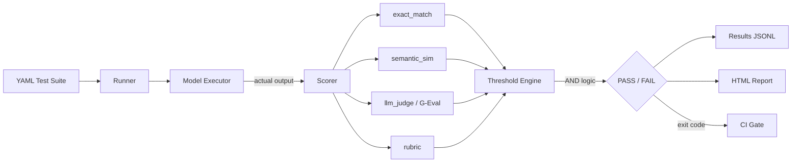
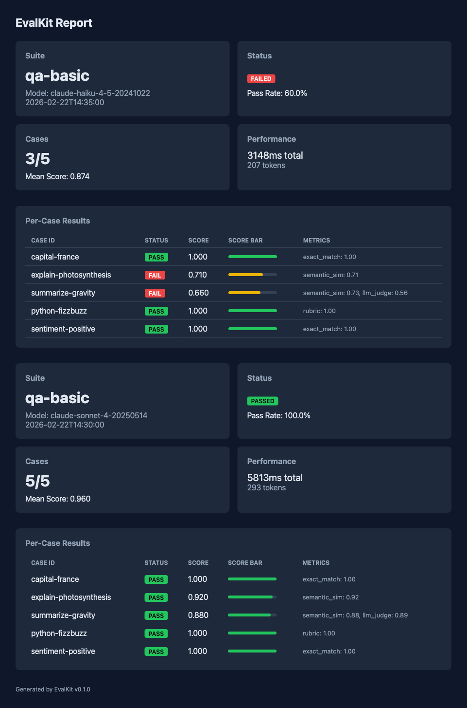

# EvalKit

CLI-first LLM evaluation framework. Define test suites in YAML, score outputs with 4 metric types, enforce pass/fail thresholds in CI.

## Why

Existing eval frameworks (DeepEval, promptfoo) are platform-coupled or heavyweight. EvalKit is a pip-installable CLI that owns the scoring math and blocks CI on regressions. It's pytest for LLM outputs.

## How It Fits

```
┌─────────────┐     ┌─────────────┐     ┌──────────────┐
│ JudgeBench  │────>│   EvalKit   │────>│  DriftWatch  │
│ validates   │     │ scores each │     │ tracks drift │
│ the judge   │     │ LLM output  │     │ over time    │
└─────────────┘     └─────────────┘     └──────────────┘
```

JudgeBench calibrates the LLM judge. **EvalKit** uses that judge (plus 3 other metrics) to score outputs. DriftWatch runs EvalKit on every PR to catch regressions.

## Architecture



## HTML Report

`evalkit report results/ --output report.html` generates a per-run dashboard with pass/fail badges, score bars, and metric breakdowns:



## Install

```bash
pip install -e .
```

## Quick Start

### 1. Define a test suite

```yaml
# evals/qa.yaml
schema_version: 1
name: qa-basic
model: claude-sonnet-4-20250514
suite_pass_rate: 0.8

cases:
  - id: capital-france
    input: "What is the capital of France?"
    expected: "Paris"
    metrics:
      - type: exact_match
        threshold: 1.0

  - id: explain-photosynthesis
    input: "Explain photosynthesis in one sentence."
    expected: "Plants convert sunlight, water, and CO2 into glucose and oxygen."
    metrics:
      - type: semantic_sim
        threshold: 0.75

  - id: summarize-gravity
    input: "Summarize Newton's law of gravitation."
    expected: "Objects attract each other proportional to mass, inverse to distance squared."
    metrics:
      - type: semantic_sim
        threshold: 0.7
        weight: 0.6
      - type: llm_judge
        threshold: 0.6
        weight: 0.4
        params:
          criteria: "Accuracy, clarity, completeness."
```

### 2. Run it

```bash
export ANTHROPIC_API_KEY=your-key
evalkit run evals/qa.yaml --output results/run1.jsonl
```

```
Running suite: qa-basic (5 cases)
Model: claude-sonnet-4-20250514

  [1/5] capital-france... PASS (score: 1.00)
  [2/5] explain-photosynthesis... PASS (score: 0.92)
  [3/5] summarize-gravity... PASS (score: 0.88)
  [4/5] python-fizzbuzz... PASS (score: 1.00)
  [5/5] sentiment-positive... PASS (score: 1.00)

┌─────────────────────────────────┐
│          Eval Summary           │
├────────────┬────────────────────┤
│ Suite      │           qa-basic │
│ Model      │ claude-sonnet-4-…  │
│ Status     │             PASSED │
│ Pass Rate  │             100.0% │
│ Cases      │                5/5 │
│ Mean Score │              0.960 │
└────────────┴────────────────────┘
```

Exit codes: `0` = passed, `1` = failed, `2` = error.

### 3. Compare runs

```bash
evalkit compare results/baseline.jsonl results/new.jsonl
```

Shows regressions, improvements, and score deltas per case.

### 4. Generate HTML report

```bash
evalkit report results/ --output report.html
```

## Metrics

| Metric | Description | Params |
|--------|-------------|--------|
| `exact_match` | Normalized string comparison | `normalize`, `ignore_case`, `ignore_punctuation` |
| `semantic_sim` | Cosine similarity via sentence-transformers (all-MiniLM-L6-v2) | `model` |
| `llm_judge` | G-Eval: generate CoT eval steps from rubric, score 1-10, normalize | `criteria`, `task`, `judge_model` |
| `rubric` | Binary pass/fail LLM assertion | `assertion`, `input`, `judge_model` |

## Design Decisions

- **AND logic** — all metrics must pass per case (conservative for CI gating)
- **YAML** for test suite definitions, **JSONL** for result logs
- **Temperature=0** for all LLM judge calls (reproducibility)
- **Versioned result schema** (`schema_version: 1`)
- **G-Eval** implementation follows Zheng et al. (NeurIPS 2023) — generate evaluation CoT, then score

## CI Integration

```yaml
# .github/workflows/eval.yml
- name: Run evals
  run: evalkit run evals/qa.yaml
  env:
    ANTHROPIC_API_KEY: ${{ secrets.ANTHROPIC_API_KEY }}
```

Non-zero exit blocks the PR.

## License

MIT
